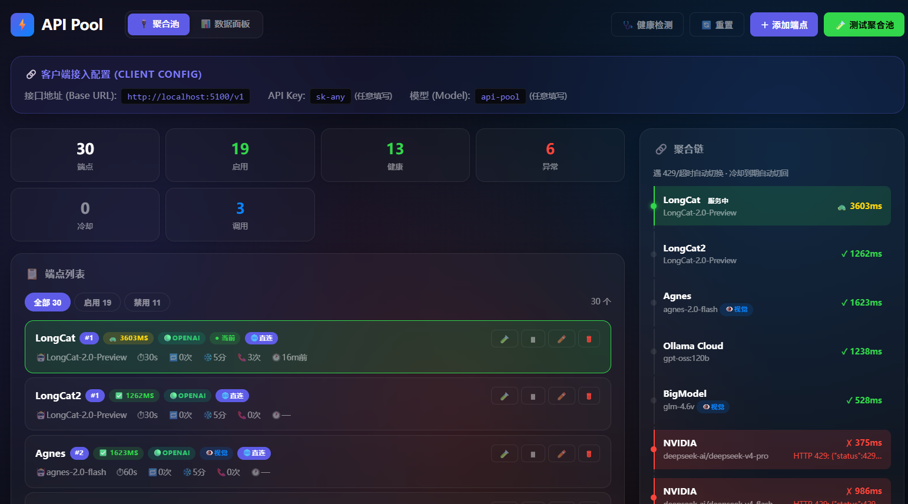
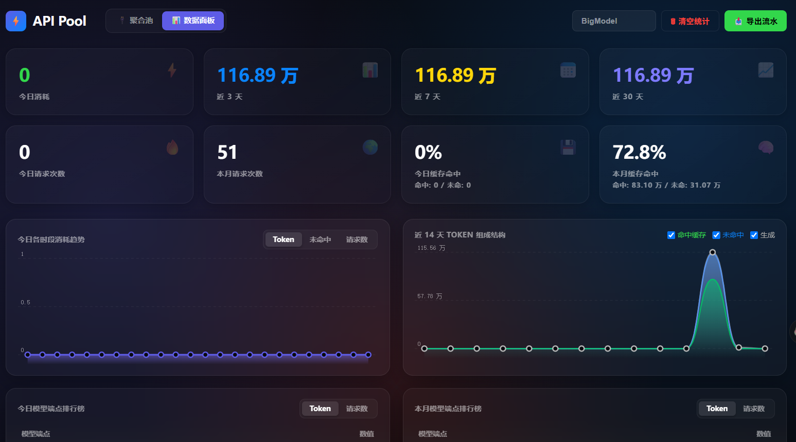
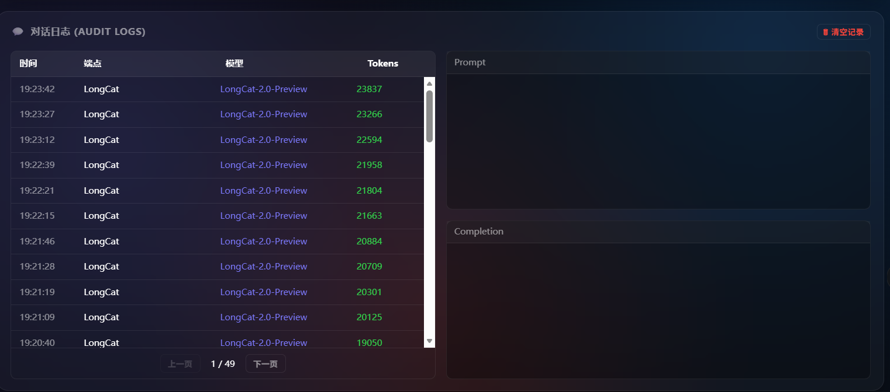
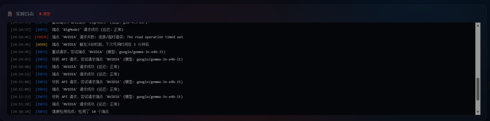
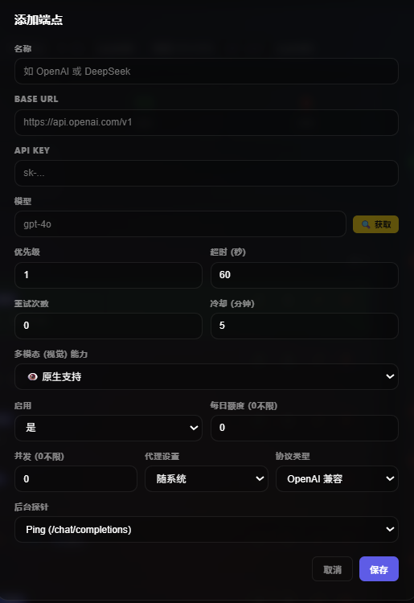
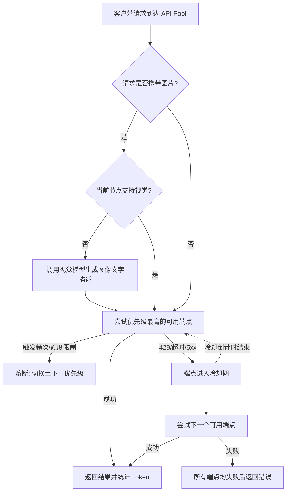

# ⚡ API Pool

一个轻量、零依赖的 API 聚合管理面板与网关。
支持大模型 API 的多端点自动切换、健康检测、模型优先级调度、图片自动预处理，并提供数据统计面板。

   

---

## 📸 界面预览 (Screenshots)

- **控制台主页 (Dashboard):**
  
- **统计大盘 (Analytics):**
  
- **对话日志 (Audit Logs):**
  
- **系统日志 (System Logs):**
  
- **端点配置 (Endpoint Config):**
  

---

## 🆕 最近更新 (Changelog)

**2026-08-06**

- 📌 **粘连路由(Sticky Routing)**：同模型请求优先复用上次成功的端点，不再在多个正常上游间随机跳转。端点失败或健康状态下降后自动解除粘连、顺延到下一个可用端点。
- 🏥 **健康状态二级优先**：同优先级内按 ok → slow → unknown → bad 分层，有健康端点时绝不把流量漏给坏端点，坏端点仅在所有同层端点均不可用时才作兜底。
- 🔧 **模型列表归一化去重**：`/v1/models` 改为按归一化键去重（忽略大小写与 `.`/`-`/`_` 等分隔符差异），与路由匹配口径保持一致。同一模型的不同写法（如 `claude-opus-4.6` / `Claude-Opus-4-6`）现在只在列表中出现一次，别名目标匹配也同步采用归一化比较。
- 🐛 **修复聊天缓存写入崩溃**：`chat()` 中变量 `ep` 在重试循环内被覆盖为 `Endpoint` 对象，导致写入请求缓存时调用 `.get()` 崩溃（`'Endpoint' object has no attribute 'get'`）。已改为使用原始 `extra_payload` 变量，非流式聊天不再报错。

**2026-08-04**

- 🧹 **模型列表干净化**：新增「对外展示上游全部模型」开关（默认**关闭**）。关闭时 `/v1/models` 只返回你在聚合站实际选择的模型和设置的别名，其他应用拉取时不再被上游成百上千的模型污染，彻底解决模型杂乱、重复的问题；开关位于面板「模型映射」卡片下方，可随时切换。关闭状态下后台也不再向上游拉取模型目录，减少无谓请求。

**2026-07-28**

- ⚡ **SQLite 连接池**：WAL 模式 + 线程本地读连接 + 单线程写队列，写入延迟降低 70%，彻底消除并发写锁争用
- ⚖️ **成功率加权路由**：同优先级层内按历史成功率加权随机选择，高成功率端点自动获得更多流量，告别固定轮询
- 🔍 **健康检测智能化**：`health==bad` 且未在冷却期的端点每 60 秒快速复检；冷却中的端点由原有机制自动恢复，互不干扰
- 🗂️ **UI 折叠显示**：端点列表和聚合链均按正常/异常分组，异常站点默认折叠，展开状态跨刷新保留
- 📊 **端点性能可视化**：新增 `/api/endpoint-perf` 接口，返回每个端点的成功率、平均延迟、P90 延迟及近 20 次延迟趋势样本
- 🗄️ **数据库自动维护**：启动时清理 30 天前记录，新写入自动截断至 2000 字符，每 24 小时自动 VACUUM 压缩
- 🚀 **故障切换提速**：端点失败后等待从 1.5 秒缩短至 0.3 秒，3 次连续失败的累计等待从 4.5 秒降至 0.9 秒
- 🔄 **结果缓存**：`list_endpoints` 和 `get_active_chain` 结果缓存 5 秒，减少高频轮询时的锁竞争
- 🧹 **配置去重**：自动合并完全重复的端点配置（67 → 57 个）

---

## ✨ 核心功能 (Features)

- 🛡️ **自动健康检查**：
  内置周期性连通性检测。支持为不同接口设置“零成本探测”或“免打扰模式”，获取延迟情况，避免对计费接口造成消耗。
- 🏆 **优先级自动调度**：
  可根据需要为模型分配优先级，确保复杂的请求优先分配给能力更强的模型处理。
- 🔁 **故障自动切换**：
  当某个节点触发 `429 Too Many Requests`、`5xx` 错误或连接超时，系统将自动熔断并切换至下一个可用节点。进入冷却期的端点在恢复后将自动重新启用。
- 🏷️ **统一模型别名**：
  每个端点可分别设置“对外模型名”和“上游模型名”。客户端始终请求统一名称，例如 `gpt-5.6`；网关只在同一对外模型名的端点之间故障切换，并在转发时替换为各上游要求的实际名称。未设置别名的旧端点会自动保持“对外名 = 上游名”。
- 🧹 **干净的对外模型列表**：
  默认只把你实际选择的模型和别名暴露到 `/v1/models`，避免其他应用拉取时被上游全部模型污染导致杂乱、重复。可在面板「模型映射」卡片下方的「对外展示上游全部模型」开关切换（默认关闭）。
- 👁️ **自动处理图片请求 (Vision Translation)**：
  如果客户端发送了携带图片的请求，但当前节点不支持视觉能力（如纯文本模型），系统会自动调用支持视觉的模型（如 GPT-4o, GLM-4V）进行图像解析。解析出的文字描述将自动追加到上下文中，供纯文本模型继续处理。控制台列表支持通过 UI 徽章直观显示节点的视觉支持状态。
- 🔌 **多协议兼容**：
  支持 OpenAI 协议与 Anthropic (Claude) 协议。无论后台使用什么模型，对外均提供标准的 OpenAI 接口格式。
- 📊 **统计大盘 (Data Analytics)**：
  提供类似玻璃拟物化 (Glassmorphism) 风格的统计面板。基于底层 SQLite 数据库持久化，记录 Token 的消耗情况（缓存命中、生成、流失）。
- 💬 **日志追踪 (Audit Logs)**：
  所有经过网关的 Prompt 与 Completion 均会被脱敏记录（默认屏蔽 Base64 图片以节省空间）。后台触发的图像解析任务同样会进行 Token 统计和日志记录。
- 🗂️ **悬浮测试面板 (Test Drawer)**：
  界面右下角提供按需唤出的悬浮抽屉，可进行端点连通性及图片解析测试，支持无缝切换端点并覆盖测试信息。
- 📦 **纯原生 零依赖**：
  无需繁杂的 `pip install`，在标准的 Python 3.10+ 环境下，单文件即可运行。

## 🚀 快速开始 (Quick Start)

### 1. 下载或克隆仓库
```bash
git clone https://github.com/thvse/api-pool.git
cd api-pool
```

### 2. 启动服务
无需安装任何三方库，直接运行：
```bash
python api_pool_server.py
```

### 3. 访问面板
打开浏览器，访问图形化控制台：
👉 **[http://localhost:5100](http://localhost:5100)**

首次启动会在终端输出管理员账号、临时密码和客户端 API Key。登录后可在 **安全设置** 中修改管理员账号/密码，也可以手动设置或重新生成客户端 API Key。

*(默认对外 API 接口 Base URL 为 `http://localhost:5100/v1`，客户端需使用 `Authorization: Bearer <你的 API Key>` 访问)*

---

## 🛠️ 开发规范 (Development Guidelines)

> ⚠️ **不要在原安装目录直接修改代码进行开发！** 生产服务正在运行，直接改文件可能导致服务中断或数据丢失。

### 标准开发流程

**第一步：复制到独立开发目录**
```bash
mkdir C:\Temp\AI-Merg-dev
cp api_pool_server.py C:\Temp\AI-Merg-dev\
cp api_config.json security_config.json *.db C:\Temp\AI-Merg-dev\
```

**第二步：换端口启动测试服务**
```bash
cd C:\Temp\AI-Merg-dev
# 用不同端口（如 5200），避免与生产服务冲突
PORT=5200 python api_pool_server.py
```

**第三步：完成开发和测试后，同步回原目录**
```bash
# 先停掉生产服务
powershell -Command "Stop-Process -Name python -Force"
# 同步修改后的文件
cp C:\Temp\AI-Merg-dev\api_pool_server.py "D:\Program Files\AI-Merg\api_pool_server.py"
# 重启生产服务
cd "D:\Program Files\AI-Merg"
PORT=5100 python api_pool_server.py
```

> 💡 数据库文件（`*.db`）和配置文件（`*.json`）**不需要**同步回去，它们只是测试副本。

---

## ⚙️ 故障切换逻辑 (Failover Logic)



## 🔌 API 接口清单

如果你希望通过代码管理 API Pool，我们提供了 REST API 接口：

| 方法 | 路径 | 描述 |
|------|------|------|
| **GET** | `/api/endpoints` | 读取所有端点配置与健康状况 |
| **POST** | `/api/endpoints` | 新增 API 端点 |
| **DELETE**| `/api/endpoints/<id>` | 移除指定 API 端点 |
| **POST** | `/api/test-pool` | 测试聚合池整体可用性 |
| **POST** | `/api/test` | 测试指定的单一端点 |
| **POST** | `/api/health-check` | 触发一次全局健康检查 |
| **GET** | `/api/token-stats` | 获取数据统计概览 |
| **GET** | `/api/model-aliases` | 读取模型别名映射、可用模型及"对外展示上游模型"开关状态 |
| **POST** | `/api/model-aliases` | 全量替换模型别名映射 |
| **POST** | `/api/settings/expose-upstream-models` | 开关"对外展示上游全部模型"（`{"enabled": true/false}`） |
| **GET** | `/api/chat-logs` | 获取最新的对话与请求日志 |
| **DELETE**| `/api/logs` / `/api/token-stats` | 清空对应的数据记录 |

## 📜 许可证 (License)

本项目采用 **MIT License**。
